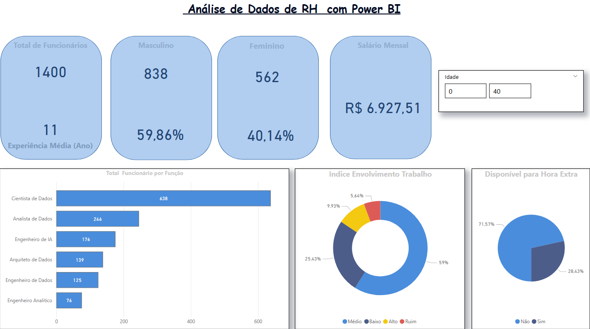

# Análise de Dados de RH

Este repositório contém o projeto **Análise de Dados de RH**, desenvolvido durante o curso da **Data Science Academy (DSA)**. Nele, apliquei conceitos de análise de dados utilizando o Power BI para criar um dashboard interativo que responde a perguntas essenciais na gestão de Recursos Humanos.

## Contexto do Projeto
O projeto foi estruturado para explorar funcionalidades importantes do Power BI, como tabelas de medidas e colunas condicionais, visando analisar dados de uma organização fictícia e proporcionar insights relevantes para decisões estratégicas.

## Perguntas Respondidas pelo Dashboard
- Qual o total de funcionários atualmente na empresa?
- Qual o tempo médio de experiência dos funcionários (em anos)?
- Qual o total e percentual de funcionários do gênero masculino e feminino?
- Qual a média salarial mensal?
- Qual o total de funcionários por função?
- Qual o percentual de funcionários disponíveis para fazer hora extra?
- Qual o nível de envolvimento dos funcionários no trabalho (Ruim, Baixo, Médio e Alto)?
- Qual o total e o percentual de funcionários que devem receber promoção? (Baseado na coluna “Anos de Experiência”).

## Ferramentas e Tecnologias Utilizadas
- **Power BI** para a criação do dashboard.
- **Microsoft Excel** para manipulação e organização da base de dados.

## Estrutura do Repositório
- `Dashboard.pbix`: Arquivo do Power BI contendo o dashboard final.
- `Dados/`: Base de dados utilizada para a análise (caso aplicável).
- `Assets/`: Imagens e capturas de tela do dashboard.

## Resultados e Insights
Os principais resultados obtidos incluem:
- A visualização do total de funcionários e sua distribuição por gênero e função.
- A identificação de padrões no tempo de experiência dos colaboradores.
- A avaliação dos níveis de engajamento no trabalho.
- A análise de disponibilidade para horas extras e critérios para promoções.

## Pré-visualização do Dashboard

## Como Visualizar o Projeto  
Faça o download do arquivo [clique aqui](https://raw.githubusercontent.com/RafaelDSena/RafaelDSena-Portfolio/main/An%C3%A1lise%20de%20Dados%20de%20RH.pbix).

Abra o arquivo no Power BI Desktop para explorar as análises e visualizações.

Este projeto demonstra a aplicação prática de análise de dados no contexto de Recursos Humanos, com foco em métricas chave e apresentação de insights claros e objetivos.
